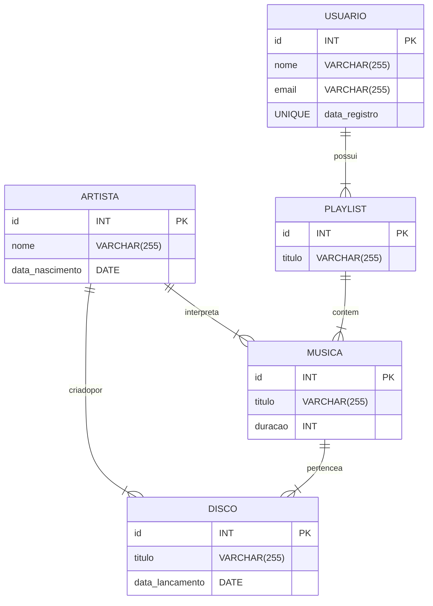

# Sistema de Streaming de musica

### Integrantes do grupo

``` 
Gabriel Balbine - R.A.: 22.222.001-4
Guilherme Albuquerque - R.A.: 22.224.024-4
Nathan Vespasiano - R.A.: 22.124.086-4
```

## Sistema de Streaming de Música - Banco de Dados

Este projeto implementa o banco de dados para um sistema de streaming de música. O sistema permite que usuários pesquisem músicas, criem playlists e acompanhem artistas e discos.

***Funcionalidades:***

* ***Música:***
    * Título
    * Duração (em segundos)
    * Disco ao qual pertence
    * Artistas que interpretam a música
* ***Artista:***
    * Nome
    * Data de nascimento
* ***Disco:***
    * Título
    * Data de lançamento
    * Artista que criou o disco
* ***Usuário:***
    * Nome
    * E-mail (único)
    * Data de registro no sistema
    * Criação e gerenciamento de playlists
* ***Playlist:***
    * Título
    * Usuário ao qual pertence
    * Músicas que a playlist contém
**Requisitos:**

* MySQL
* Python 3

**Instalação:**

1. Crie um banco de dados chamado "streaming_musica".
2. Execute o script  create_tables.sql  para criar as tabelas do banco de dados.
3. Execute o script  insert_data.py  para inserir dados aleatórios nas tabelas.

Uso:

* Use o script insert_data.py para inserir mais dados no banco de dados.
* Utilize o MySQL Workbench ou outro cliente SQL para consultar e manipular os dados.

*Diagrama Relacional:*



## *Modelo Relacional em 3FN (Normalização)*:

*Musica: (id, titulo, duracao, disco_id, artista_id)*

*Disco: (id, titulo, data_lancamento, artista_id)*

*Artista: (id, nome, data_nascimento)*

*Usuario: (id, nome, email, data_registro)*

*Playlist: (id, titulo, usuario_id)*

*Playlist_Musica: (playlist_id, musica_id)*

## Como executar o código
> [!NOTE]
> Para executar esse código você precisará ter instalado na sua máquina o Python e o MySQL

## Tutoriais de download
   + [Como baixar o MySQL](https://www.youtube.com/watch?v=IEUgVwjXF0o&pp=ygUTQ29tbyBiYWl4YXIgbyBNeVNRTA%3D%3D)
   + [Como baixar o python](https://www.youtube.com/watch?v=0pG4NrucQR4&pp=ygUUQ29tbyBiYWl4YXIgbyBweXRob24%3D)

   
